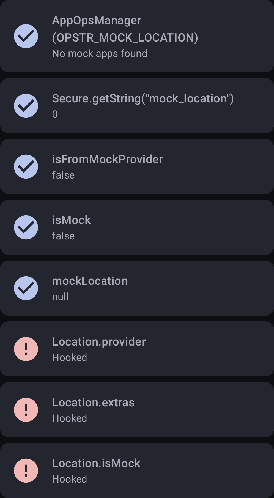

# Mock Location Detector

An Android app that detects mock locations (GPS spoofing) using multiple techniques. Helps developers and privacy‑conscious users verify if the device’s location is genuine.

## Features
- 🔍 Detects mock location through 4 different methods
- 📱 Modern UI built with Jetpack Compose
- 🧪 Shows detailed results for each detection technique
- 🔐 Handles location permissions gracefully

## Detection Methods

The app runs the following checks when you tap **Run Detection**:

| Method | Description |
|--------|-------------|
| **AppOpsManager** | Checks if any installed app has the `ACCESS_MOCK_LOCATION` permission and is allowed to inject mock locations. |
| **Settings.Secure** | Reads the deprecated `mock_location` system setting (non‑zero value indicates mock is enabled). |
| **Location object** | Inspects the current location obtained via FusedLocationProviderClient: • `isFromMockProvider` (deprecated) • `isMock` (API 31+) • `extras` bundle flag `mockLocation` |
| **Hook detection** | Verifies that common `Location` class fields (provider, extras, isMock) have not been tampered with via runtime hooks. |

## Bypassing Detection

Detection can be reduced to zero by using the [HideMockLocation](https://github.com/auag0/HideMockLocation) Xposed module. To achieve this, ensure that you include **System Framework** and **Settings Storage** in the module's scope within your Xposed manager (e.g., LSPosed).

## How It Works

1. The app requests coarse/fine location permissions.
2. When you press **Run Detection**:
    - It checks all installed packages for mock location privileges (`AppOpsManager`).
    - It reads the secure settings for the legacy `mock_location` flag.
    - It fetches the current location using Google Play Services’ FusedLocationProviderClient.
    - It analyses the returned `Location` object for mock indicators.
    - It performs hook detection by creating a test `Location` and verifying expected behaviour.
3. Results are displayed in a scrollable list, with red icons indicating a mock location was detected.

## Permissions

- `ACCESS_COARSE_LOCATION` – approximate location for detection (balanced power/accuracy).
- `ACCESS_FINE_LOCATION` – precise location (required for high‑accuracy checks).
- `QUERY_ALL_PACKAGES` – needed to enumerate all installed apps and check their declared permissions.

> The app does **not** store or transmit any location data. All processing is done on‑device.